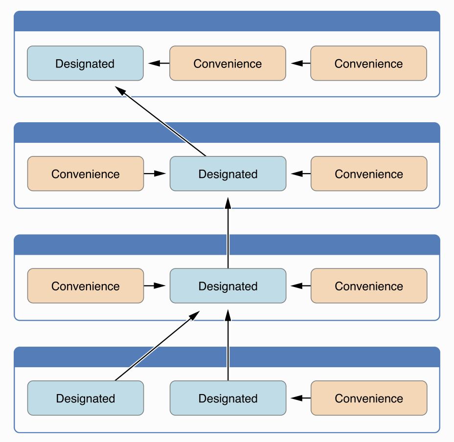

[TOC]

`Initialization` is the process of preparing an instance of a 

- class
- structure
- enumeration，I think is not necessary

### Initial Values

Stored Properties

- setting values in Initializer
- specify a default property value as part of the property’s declaration

```swift
struct Fahrenheit1 {
    var temperature: Double
    init() {
        temperature = 32.0
    }
}

struct Fahrenheit2 {
    var temperature = 32.0
} 
```

Optional Property Types

- automatically initialized with a value of nil

```swift
class SurveyQuestion {
    var text: String
    var response: String?
    init(text: String) {
        self.text = text
    }
    func ask() {
        print(text)
    }
}
```

Constant Properties, once a constant property is assigned a value, it can’t be further modified

- specify a default property value as part of the property’s declaration
- setting values in Initializer

```swift
class IniSurveyQuestion {
    let text: String = "12"            // init
    let text2: String
    var response: String?
    init(text: String) {
        self.text2 = text            // init
    }
    func ask() {
        print(text)
    }
}
```

### Customizing Initialization

Parameter

- Parameter Names and Argument Labels
- Initializer Parameters Without Argument Labels

### Default Initializer

- for any structure or class 
- provides default values for all of its properties 
- does not provide at least one initializer itself

```swift
// default initializer, for class , struct
class InitShoppingListItem {
    var name: String?
    var quantity = 1
    var purchased = false
}

let item = InitShoppingListItem()
print("test default initializer: " , item)
```

### Memberwise Initializers for Structure Types

- do not define any of their own custom initializers
- even if it has stored properties that don’t have default values

```swift
struct Size {
    var width = 0.0, height = 0.0
}
let twoByTwo = Size(width: 2.0, height: 2.0)
```

### Initializer Delegation for Value Types

initializer delegation

- structures and enumerations
- Initializers can call other initializers

```swift
struct Size {
    var width = 0.0, height = 0.0
}
struct Point {
    var x = 0.0, y = 0.0
}

struct Rect {
    var origin = Point()
    var size = Size()
    init() {}
    init(origin: Point, size: Size) {
        self.origin = origin
        self.size = size
    }
    init(center: Point, size: Size) {
        let originX = center.x - (size.width / 2)
        let originY = center.y - (size.height / 2)
        self.init(origin: Point(x: originX, y: originY), size: size)
    }
}
```

### Class Inheritance and Initialization

Designated initializers 

- are the primary initializers for a class. 
- fully initializes all properties introduced by that class and
- calls an appropriate superclass initializer to continue the initialization process up the superclass chain

```swift
init(parameters) {
    statements
}
```


Convenience initializers，有`convenience`关键词

- to call a designated initializer from the same class

- or call a convenience initizlizer

```swift
convenience init(parameters) {
    statements
}
```




#### Initializer Delegation

- A designated initializer must call a designated initializer from its immediate superclass 
- A convenience initializer must call another initializer from the same class
- A convenience initializer must ultimately call a designated initializer

#### Two-Phase Initialization

- In the first phase, each stored property is assigned an initial value by the class that introduced it. 
- second phase, each class is given the opportunity to customize its stored properties further before the new instance is considered ready for use


Four safety-checks to make sure that two-phase initialization is completed without error

- A designated initializer must ensure that all of the properties introduced by its class are initialized before it delegates up to a superclass initializer.
- A designated initializer must delegate up to a superclass initializer before assigning a value to an inherited property. If it doesn’t, the new value the designated initializer assigns will be overwritten by the superclass as part of its own initialization.
- A convenience initializer must delegate to another initializer before assigning a value to any property (including properties defined by the same class). If it doesn’t, the new value the convenience initializer assigns will be overwritten by its own class’s designated initializer.
- An initializer cannot call any instance methods, read the values of any instance properties, or refer to self as a value until after the first phase of initialization is complete.


**阶段 1**

- 类的某个指定构造器或便利构造器被调用。
- 完成类的新实例内存的分配，但此时内存还没有被初始化。
- 指定构造器确保其所在类引入的所有存储型属性都已赋初值。存储型属性所属的内存完成初始化。
- 指定构造器切换到父类的构造器，对其存储属性完成相同的任务。
- 这个过程沿着类的继承链一直往上执行，直到到达继承链的最顶部。
- 当到达了继承链最顶部，而且继承链的最后一个类已确保所有的存储型属性都已经赋值，这个实例的内存被认为已经完全初始化。此时阶段 1 完成。

**阶段 2**

- 从继承链顶部往下，继承链中每个类的指定构造器都有机会进一步自定义实例。构造器此时可以访问 `self`、修改它的属性并调用实例方法等等。
- 最终，继承链中任意的便利构造器有机会自定义实例和使用 `self`。


#### 构造器的继承和重写

**子类默认情况下不会继承父类的构造器**。这种机制可以防止一个父类的简单构造器被一个更精细的子类继承，而在用来创建子类的新实例时没有完全或错误被初始化。


子类重写父类构造器

- 重写指定构造器，必须带上`override`，包括重写父类的默认构造器
- 重写便利构造器，不需要带上`override`。因为子类便利构造器不能直接调用父类便利构造器，严格意义来讲，这不属于重写

```swift
class Vehicle {
    var numberOfWheels = 0
    var description: String {
        return "\(numberOfWheels) wheel(s)"
    }
}

class Bicycle: Vehicle {
    override init() {
        super.init()
        numberOfWheels = 2
    }
}

class Hoverboard: Vehicle {
    var color: String
    init(color: String) {
        self.color = color
        // super.init() 在这里被隐式调用.没有
    }
    override var description: String {
        return "\(super.description) in a beautiful \(color)"
    }
}
```


#### 构造器的自动继承

子类在默认情况下不会继承父类的构造器，在子类引入的属性能够被初始化的前提下，以下场景，子类会自动继承父类构造器：

- 如果子类没有定义任何指定构造器，它将自动继承父类所有的指定构造器
- 如果子类提供了所有父类指定构造器的实现，将自动继承父类所有的便利构造器
  - 可以通过规则 1 继承过来
  - 或者提供了自定义实现，包括将父类的指定构造器重写为便利构造器

```swift
class Food {
    var name: String
    init(name: String) {
        self.name = name
    }
    
    convenience init() {
        self.init(name: "[Unnamed]")
    }
}
```

`RecipeIngredient`将父类指定构造器，重写为便利构造器。`RecipeIngredient`会继承所有的便利构造器。

```swift
class RecipeIngredient: Food {
    var quantity: Int
    init(name: String, quantity: Int) {
        self.quantity = quantity
        super.init(name: name)
    }
    override convenience init(name: String) {
        self.init(name: name, quantity: 1)
    }
}
```

`ShoppingListItem`为自己引入的所有属性都提供了默认值，并且自己没有定义任何构造器，`ShoppingListItem` 将自动继承所有父类中的指定构造器和便利构造器。

```swift
class ShoppingListItem: RecipeIngredient {
    var purchased = false
    var description: String {
        var output = "\(quantity) x \(name)"
        output += purchased ? " ✔" : " ✘"
        return output
    }
}
```


### Failable Initializers

To cope with initialization conditions that can fail, define one or more failable initializers as part of a class, structure, or enumeration definition. 

- placing a question mark after the init keyword (init?)
- return nil within a failable initializer 

```swift
struct Animal {
    let species: String
    init?(species: String) {
        if species.isEmpty { return nil }
        self.species = species
    }
}
```

#### Failable Initializers for Enumerations

Enumerations with raw values automatically receive a failable initializer

```swift
enum InitTemperatureUnit {
    case kelvin, celsius, fahrenheit
    init?(symbol: Character) {
        switch symbol {
        case "K":
            self = .kelvin
        case "C":
            self = .celsius
        case "F":
            self = .fahrenheit
        default:
            return nil
        }
    }
}

// has default init?(rawValue:)
enum InitTemperatureUnit2: Character {
    case kelvin = "K", celsius = "C", fahrenheit = "F"
}
```

#### Delegation

- A failable initializer of a class, structure, or enumeration can delegate across to another failable initializer from the same class, structure, or enumeration. 
- Similarly, a subclass failable initializer can delegate up to a superclass failable initializer.
- A failable initializer can also delegate to a nonfailable initializer

```swift
class Product {
    let name: String
    init?(name: String) {
        if name.isEmpty { return nil }
        self.name = name
    }
}

class CartItem: Product {
    let quantity: Int
    init?(name: String, quantity: Int) {
        if quantity < 1 { return nil }
        self.quantity = quantity
        super.init(name: name)
    }
}     
```

#### Overriding

- can override a superclass failable initializer in a subclass
- can override a superclass failable initializer with a subclass nonfailable initializer

### Required Initializers

- subclass of the class must implement that initializer

- must also write the required modifier before every subclass implementation

```swift
class InitPerson {
    let age : Int = {
        let a = 1
        let b = 2
        print("InitPerson age function")
        return a + b
    }()
    var name : String


    required init() {
        self.name = ""
    }
}

class InitDoctor: InitPerson {
    required init() {
        super.init()
        self.name = "doctor"
    }
}
```

### Setting a Default Property Value with a Closure or Function

- can use a closure or global function to provide a customized default value for that property.”

- Whenever a new instance of the type that the property belongs to is initialized, the closure or function is called

- the closure or function in a instance can be called only once

```swift
class InitPerson {
    let age : Int = {
        let a = 1
        let b = 2
        print("InitPerson age function")
        return a + b
    }()
    var name : String


    required init() {
        self.name = ""
    }
}
```